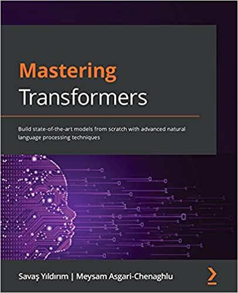

# Mastering Transformers

<a href="https://www.packtpub.com/product/mastering-transformers/9781801077651"></a>

This is the code repository for [Mastering Transformers](https://www.amazon.com/Mastering-Transformers-state-art-processing/dp/1801077657), published by Packt.

**Build state-of-the-art models from scratch with advanced natural language processing techniques**

## What is this book about?
Transformer-based language models have dominated natural language processing (NLP) studies and have now become a new paradigm. With this book, you'll learn how to build various transformer-based NLP applications using the Python Transformers library.

This book covers the following exciting features: 
* Explore state-of-the-art NLP solutions with the Transformers library
* Train a language model in any language with any transformer architecture
* Fine-tune a pre-trained language model to perform several downstream tasks
* Select the right framework for the training, evaluation, and production of an end-to-end solution
* Get hands-on experience in using TensorBoard and Weights & Biases
* Visualize the internal representation of transformer models for interpretability

If you feel this book is for you, get your [copy](https://www.amazon.com/Mastering-Transformers-advanced-processing-techniques/dp/1801077657) today!

<a href="https://www.packtpub.com/?utm_source=github&utm_medium=banner&utm_campaign=GitHubBanner"></a>

## Instructions and Navigations
All of the code is organized into folders. For example, Chapter03.

The code will look like the following:

```
import pandas as pd
imdb_df = pd.read_csv("IMDB Dataset.csv")
reviews = imdb_df.review.to_string(index=None)
with open("corpus.txt", "w") as f:
      f.writelines(reviews)

```

**Following is what you need for this book:**
This book is for deep learning researchers, hands-on NLP practitioners, as well as ML/NLP educators and students who want to start their journey with Transformers. Beginner-level machine learning knowledge and a good command of Python will help you get the best out of this book.

With the following software and hardware list you can run all code files present in the book (Chapter 1-11).

### Software and Hardware List

| Chapter  | Software required                                                                                  | OS required                        |
| -------- | ---------------------------------------------------------------------------------------------------| -----------------------------------|
| 1-11     | Python 3.6x, Transformers, Google Colaboratory, Jupyter Notebook, TensorFlow                       | Windows, Mac OS X, and Linux (Any) |
| 10       | Docker, Locust.io										                                                              | Windows, Mac OS X, and Linux (Any) |

We also provide a PDF file that has color images of the screenshots/diagrams used in this book. [Click here to download it]( https://static.packt-cdn.com/downloads/9781801077651_ColorImages.pdf).

## Code in Action

Click on the following link to see the Code in Action:

https://bit.ly/3i4vFzJ

### Related products <Other books you may enjoy>
* Getting Started with Google BERT [[Packt]](https://www.packtpub.com/product/getting-started-with-google-bert/9781838821593) [[Amazon]](https://www.amazon.in/Getting-Started-Google-BERT-state-ebook/dp/B08LLDF377)

* Snowflake Cookbook [[Packt]](https://www.packtpub.com/product/snowflake-cookbook/9781800560611) [[Amazon]](https://www.amazon.in/Snowflake-Cookbook-Techniques-warehousing-solutions-ebook/dp/B08PDJ7CTX)

## Get to Know the Author
**Savaş Yıldırım**
He graduated from the Istanbul Technical University Department of Computer Engineering and holds a Ph.D. degree in Natural Language Processing (NLP). Currently, he is an associate professor at the Istanbul Bilgi University, Turkey, and is a visiting researcher at the Ryerson University, Canada. He is a proactive lecturer and researcher with more than 20 years of experience teaching courses on machine learning, deep learning, and NLP.

**Meysam Asgari-Chenaghlu**
He is an AI manager at Carbon Consulting and is also a Ph.D. candidate at the University of Tabriz. He has been a consultant for Turkey's leading telecommunication and banking companies. He has also worked on various projects, including natural language understanding and semantic search.

